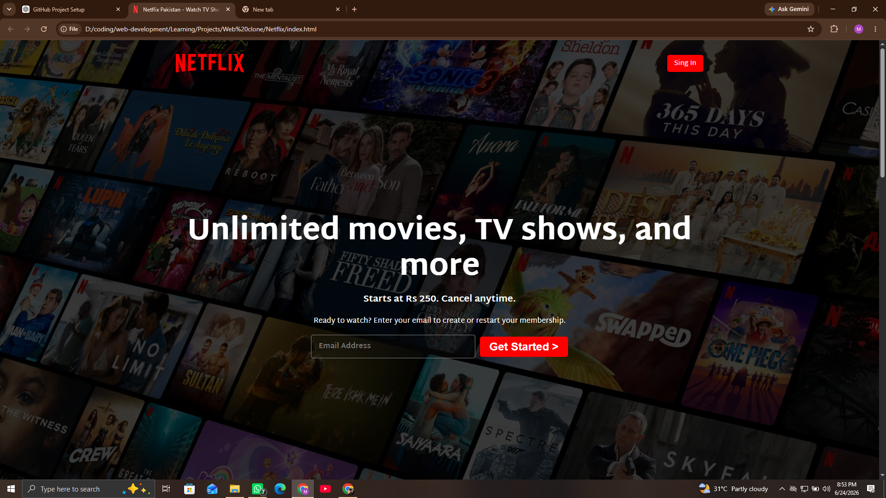

# 🎬 Netflix Clone UI

A modern and responsive Netflix landing page clone built using HTML, CSS, and JavaScript.

## ✨ Features

- Pixel-perfect Netflix-inspired UI
- Fully Responsive Design
- Smooth Animations
- Hero Section
- Trending Movies Slider
- FAQ Accordion
- Hover Effects
- Clean Folder Structure
- Optimized CSS
- Vanilla JavaScript

## 🛠 Tech Stack

- HTML5
- CSS3
- JavaScript (ES6)

## 📱 Responsive

- Desktop
- Laptop
- Tablet
- Mobile

## 📂 Project Structure

```
Netflix-Clone/
│
├── assets/
│   ├── images/
│   └── thumbnails/
│
├── style.css
│
├── script.js
│
└── index.html
```

## 🚀 Live Demo

https://netflix-cloneui.vercel.app/

## 📷 Preview




## 📌 Future Improvements

- Authentication
- Movie API Integration
- React Version
- Firebase Backend

---

Inspired by Netflix for educational purposes only.
